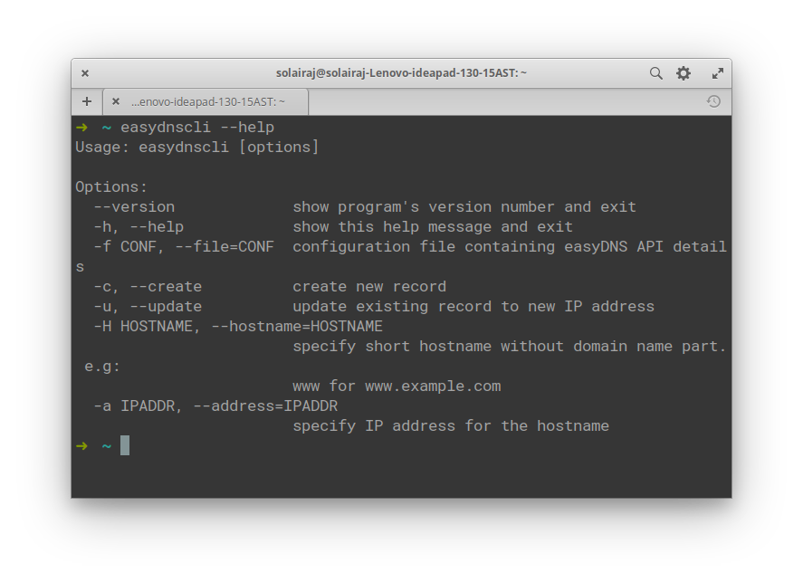

# easydns-restapi-cli

A command-line tool for managing (create/update) EasyDNS DNS records using easyDNS rest API.



### Requirements

- [git](https://git-scm.com/downloads) 
- [Python 3](https://www.python.org/downloads/)
- [EasyDNS API](https://docs.sandbox.rest.easydns.net/)

### INSTALLATION
```
$ git clone https://github.com/tuladhar/easydns-restapi-cli
$ cd easydns-restapi-cli && install.sh
$ easydnscli: installed
$ easydnscli --help

```

### CONFIGURATION
```
{
	"domain": "XYZ",
	"token": "XYZ",
	"key": "XYZ",
	"endpoint": "http://sandbox.rest.easydns.net",
	"format": "json",
	"delay": 5,
	"ttl": 600
}
```

* `domain` - domain to manage
* `token` - API token received from EasyDNS
* `key` - API key received from EasyDNS
* `endpoint` - API endpoint received from EasyDNS
* `delay` - delay (in seconds) between subsequent API calls to get pass rate limiting
* `ttl` - TTL to use when creating/updating DNS records 

### USAGE

Create DNS record (Syntax)

```
$ easydnscli --conf "PATH TO CONFIG FILE" --create --hostname www --address 127.0.0.1
```
Create DNS record (Example)

```
$ easydnscli --conf Downloads/sample-easydns.conf --create --hostname www --address 127.0.0.1
```

Update DNS record (Syntax)

```
$ easydnscli --conf "PATH TO CONFIG FILE" --update --hostname www --address 127.0.0.1
```
Update DNS record (Example)

```
$ easydnscli --conf Downloads/sample-easydns.conf --update --hostname www --address 127.0.0.1
```

### AUTHORS
- [Puru Tuladhar](github.com/tuladhar)
- [Solai Raj](gitub.com/RajSolai)
